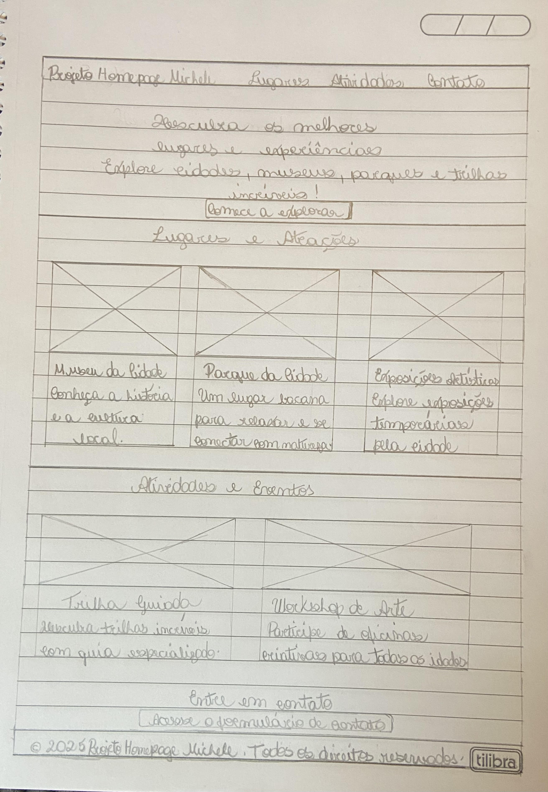
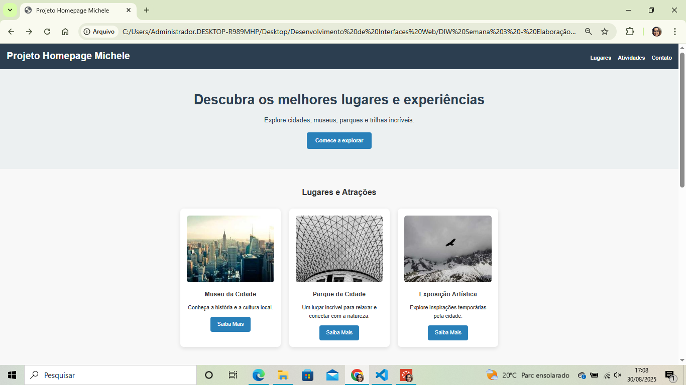

# diw-semana-3-atividade-pratica
Projeto e construção de Home-page - Atividade Prática Semana 3 - Desenvolvimento de Interfaces Web - Ciência da Computação - Puc Minas Liberdade - Michele
Dados básicos:
1-Nome: Michele Francisca de Almeida
2-Número de matrícula: 897336
3-Proposta de projeto escolhida: Lugares e Experiências
4-Breve descrição sobre o projeto: O Projeto Homepage Michele foi idealizado e pensado para que todas as pessoas possam por meio da homepage explorar os melhores lugares e atividades da cidade com uma página interativa, moderna e responsiva. Descubra atrações, eventos e envie suas mensagens diretamente pelo formulário de contato.
5-Imagem do esboço (wireframe) criado para o projeto

6-Print da home-page criada para o projeto
